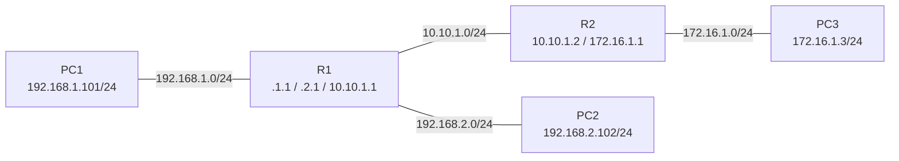

# Schéma de topologie - Atelier Routage

## Réseaux en présence

| Réseau | Adresse | Machines connectées |
|---|---|---|
| REZ1 | 192.168.1.0/24 | PC1 ↔ R1 |
| REZ2 | 192.168.2.0/24 | PC2 ↔ R1 |
| REZ3 | 10.10.1.0/24 | R1 ↔ R2 |
| REZ4 | 172.16.1.0/24 | R2 ↔ PC3 |

## Passerelles par défaut

| Machine | Passerelle |
|---|---|
| PC1 | 192.168.1.1 (R1) |
| PC2 | 192.168.2.1 (R1) |
| PC3 | 172.16.1.1 (R2) |

## Routes à ajouter manuellement (réseaux non directement connectés)

- Sur **R1** : route vers 172.16.1.0/24 via 10.10.1.2
- Sur **R2** : route vers 192.168.1.0/24 via 10.10.1.1
- Sur **R2** : route vers 192.168.2.0/24 via 10.10.1.1
